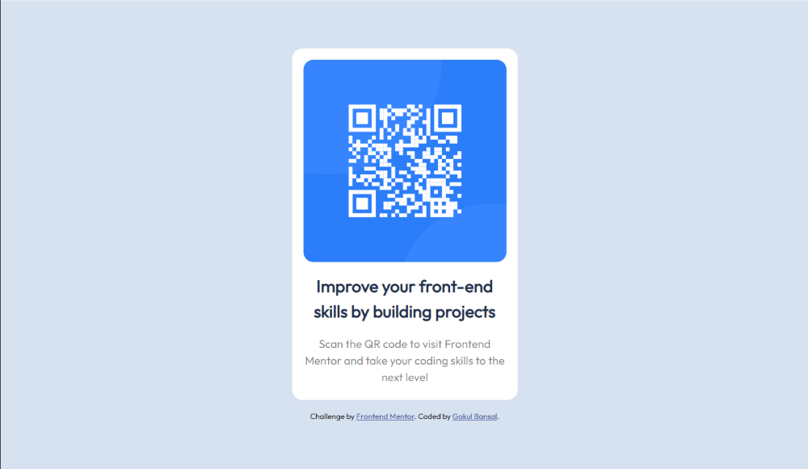

# Frontend Mentor - QR code component solution

This is a solution to the [QR code component challenge on Frontend Mentor](https://www.frontendmentor.io/challenges/qr-code-component-iux_sIO_H). Frontend Mentor challenges help you improve your coding skills by building realistic projects. 

## Table of contents

- [Frontend Mentor - QR code component solution](#frontend-mentor---qr-code-component-solution)
  - [Table of contents](#table-of-contents)
  - [Overview](#overview)
    - [Screenshot](#screenshot)
    - [Links](#links)
  - [My process](#my-process)
    - [Built with](#built-with)
    - [What I learned](#what-i-learned)

## Overview

### Screenshot

### Links

- Solution URL: [Add solution URL here](https://bansalgokul.github.io/QR-code-component/)

## My process

### Built with

- Semantic HTML5 markup
- Flexbox
- CSS Grid
- Mobile-first workflow

### What I learned

This was my first project where I just used a design image to create a webpage. It provided me with confidence that I can now use the things I learnt to develop websites and more.
Also I learn about how to use a photo editor for knowing margins and paddings as figma or canva sketch was not available to me.
I learnt about reducing the number of div tags to minimum in my page.
